# Домашнее задание к занятию «Базовые объекты K8S» - Илларионов Дмитрий

### Цель задания

В тестовой среде для работы с Kubernetes, установленной в предыдущем ДЗ, необходимо развернуть Pod с приложением и подключиться к нему со своего локального компьютера. 

------

### Чеклист готовности к домашнему заданию

1. Установленное k8s-решение (например, MicroK8S).
2. Установленный локальный kubectl.
3. Редактор YAML-файлов с подключенным Git-репозиторием.

------

### Инструменты и дополнительные материалы, которые пригодятся для выполнения задания

1. Описание [Pod](https://kubernetes.io/docs/concepts/workloads/pods/) и примеры манифестов.
2. Описание [Service](https://kubernetes.io/docs/concepts/services-networking/service/).

------

### Задание 1. Создать Pod с именем hello-world

1. Создать манифест (yaml-конфигурацию) Pod.
2. Использовать image - gcr.io/kubernetes-e2e-test-images/echoserver:2.2.
3. Подключиться локально к Pod с помощью `kubectl port-forward` и вывести значение (curl или в браузере).

#### Решение

Создал my1pod.yaml

```
nano my1pod.yaml
```
Содержимое:

```
apiVersion: v1
kind: Pod
metadata:
  name: my1pod
spec:
  containers:
  - name: my1pod
    image: gcr.io/kubernetes-e2e-test-images/echoserver:2.2
    ports:
    - containerPort: 8080
```

Создал под

```
kubectl apply -f my1pod.yaml
```

Сделал проброс портов (временный для проверки):

```
kubectl port-forward -n default pod/my1pod 18080:8080 --address='0.0.0.0'
```

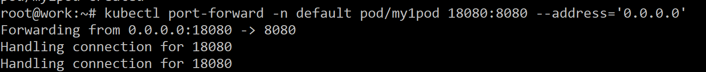

Подключился из браузера:

```
http://89.169.139.63:18080/
```
Результат:

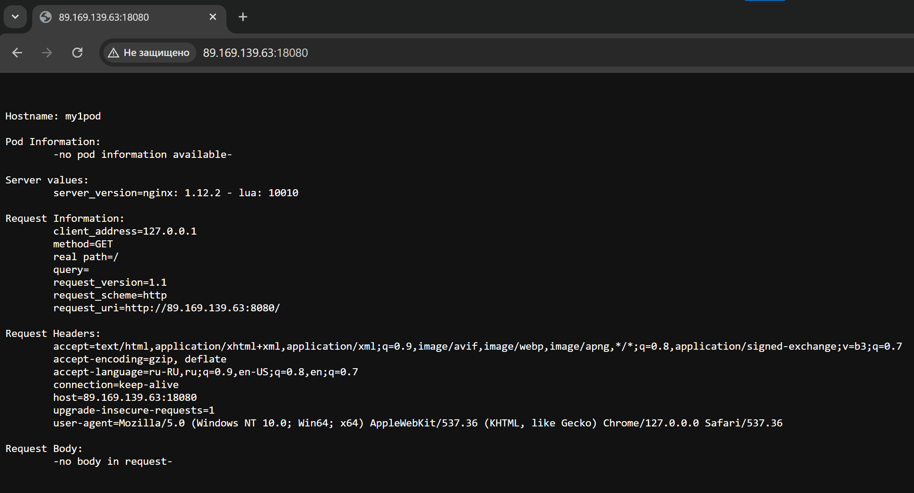


------

### Задание 2. Создать Service и подключить его к Pod

1. Создать Pod с именем netology-web.
2. Использовать image — gcr.io/kubernetes-e2e-test-images/echoserver:2.2.
3. Создать Service с именем netology-svc и подключить к netology-web.
4. Подключиться локально к Service с помощью `kubectl port-forward` и вывести значение (curl или в браузере).

#### Решение задания 2

Создал netology-web.yaml

```
nano netology-web.yaml
```
Содержимое:

```
apiVersion: v1
kind: Pod
metadata:
  name: netology-web
spec:
  containers:
  - name: netology-web
    image: gcr.io/kubernetes-e2e-test-images/echoserver:2.2
    ports:
    - containerPort: 8080
```

Создал под

```
kubectl apply -f netology-web.yaml
```

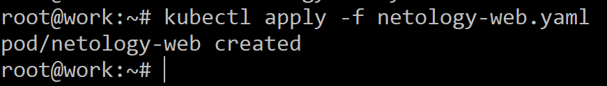

Сделал проброс портов (временный для проверки):

```
kubectl port-forward -n default pod/netology-web 28080:8080 --address='0.0.0.0'
```

Подключился из браузера:

```
http://89.169.139.63:28080/
```
Результат:

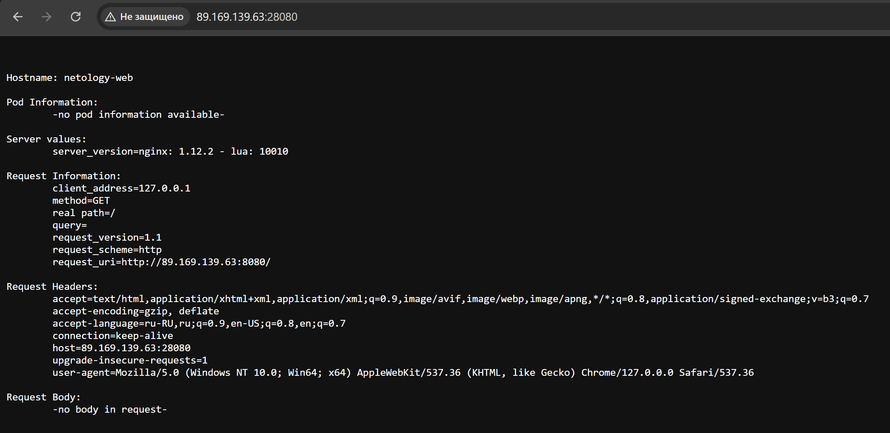

Завершил проброс портов для пода.

Удалил созданный под:


```
kubectl delete netology-web
```
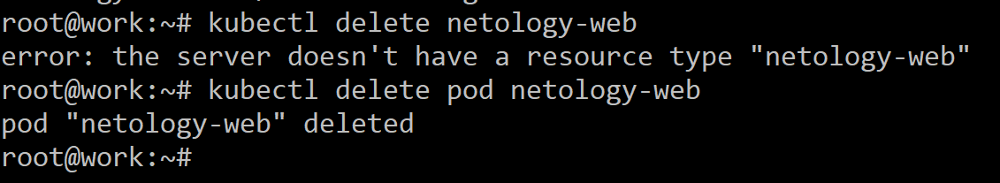

Видно что пда нет:

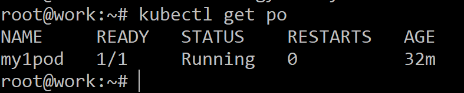

Добавил метку labels - поправил файл yaml пода:

```
apiVersion: v1
kind: Pod
metadata:
  name: netology-web
  labels:
    app: myapp
spec:
  containers:
  - name: netology-web
    image: gcr.io/kubernetes-e2e-test-images/echoserver:2.2
    ports:
    - containerPort: 8080
```

Опять запускаю под:

```
kubectl apply -f netology-web.yaml
```
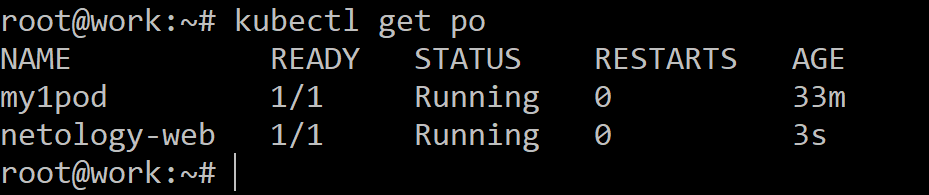

Создаю файл для создания сервиса:

```
nano netology-svc.yaml
```
Содержимое:

```
apiVersion: v1
kind: Service
metadata:
  name: netology-svc
spec:
  selector:
    app: myapp
  ports:
    - name: http
      protocol: TCP
      port: 80
      targetPort: 8080
```
Применяю конфигурацию:

```
kubectl apply -f netology-svc.yaml
```

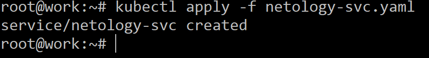

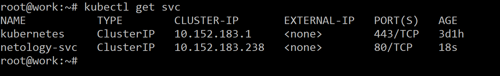

```
root@work:~# kubectl get svc
NAME           TYPE        CLUSTER-IP       EXTERNAL-IP   PORT(S)   AGE
kubernetes     ClusterIP   10.152.183.1     <none>        443/TCP   3d1h
netology-svc   ClusterIP   10.152.183.238   <none>        80/TCP    18s
```

Делаю проброс порта временн для проверки:

```
kubectl port-forward -n default svc/netology-svc 38080:80 --address='0.0.0.0'
```

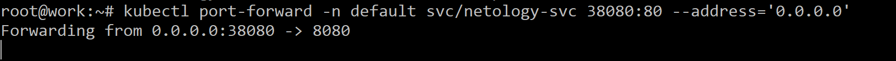

Проверяю из браузера:

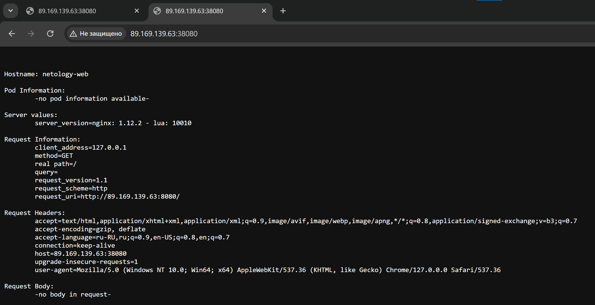

Созданные yaml файлы положил и в git.

----

# Вопросы

Почему при удалении пода команда висит долго - около минуты?:


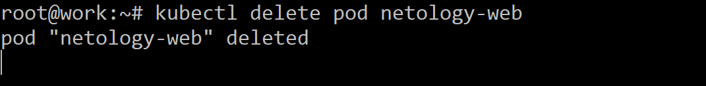

И потом только появляется команданя строка дял новой команды:


Странно что для удаления пода нужна 1 минута примерно. Почему так долго?

------

### Правила приёма работы

1. Домашняя работа оформляется в своем Git-репозитории в файле README.md. Выполненное домашнее задание пришлите ссылкой на .md-файл в вашем репозитории.
2. Файл README.md должен содержать скриншоты вывода команд `kubectl get pods`, а также скриншот результата подключения.
3. Репозиторий должен содержать файлы манифестов и ссылки на них в файле README.md.

------

### Критерии оценки
Зачёт — выполнены все задания, ответы даны в развернутой форме, приложены соответствующие скриншоты и файлы проекта, в выполненных заданиях нет противоречий и нарушения логики.

На доработку — задание выполнено частично или не выполнено, в логике выполнения заданий есть противоречия, существенные недостатки.
